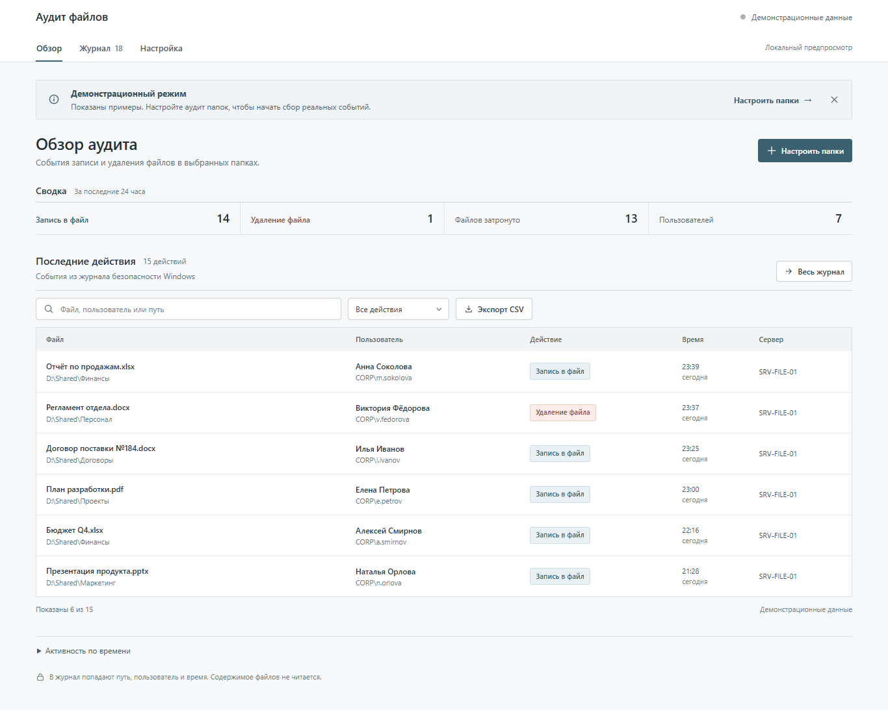
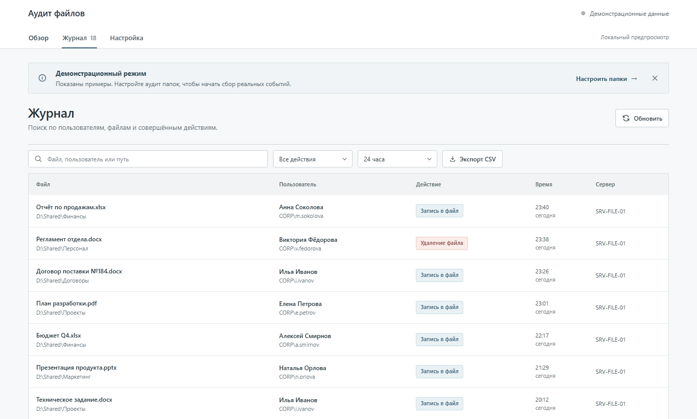
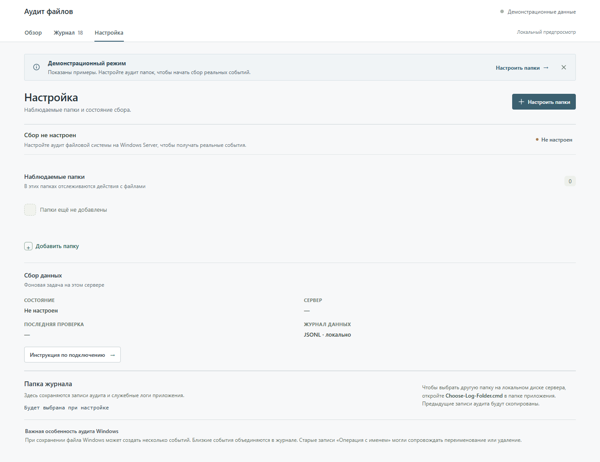

# Аудит файлов

Локальное приложение для Windows Server. Оно показывает, кто, когда и с какими файлами работал, ищет события и выгружает журнал в CSV. Учитываются файлы с любыми расширениями, включая файлы без расширения; содержимое файлов не читается.

Пошаговое руководство: [инструкция.md](инструкция.md).

## Запуск в один клик

Скопируйте всю папку `file-audit` на файловый сервер в постоянное место. Дважды щёлкните **`Start-Audit.cmd`** и подтвердите запрос Windows. При первом запуске выберите общую папку с файлами и папку для журнала аудита — приложение само включит аудит, установит фоновый сборщик и откроет панель в браузере. Если отменить выбор папки журнала, используется `C:\ProgramData\DocumentAudit`. Не перемещайте папку приложения после настройки: от её расположения зависит задача фонового сбора.

Для работы нужны Windows PowerShell и Windows с графическим рабочим столом. Node.js, npm, база данных и подключение к интернету не требуются.

Чтобы добавить папки позже, дважды щёлкните **`Configure-Audit.cmd`** и выберите дополнительные каталоги. Ранее выбранные папки сохранятся. Чтобы изменить только папку журнала, дважды щёлкните **`Choose-Log-Folder.cmd`**. Выбирайте папку на локальном диске сервера: фоновая задача от `SYSTEM` не видит подключённые сетевые диски. Предыдущие файлы `events*.jsonl` копируются в новое место; старые копии остаются в прежней папке. Если папка журнала находится внутри наблюдаемой папки, собственные файлы журнала исключаются из аудита приложения.

Панель доступна по адресу `http://127.0.0.1:4173` на самом сервере. Сборщик продолжает работу после закрытия браузера и запускается при перезагрузке Windows.

## Что видит пользователь

- Отдельные количества действий «Запись в файл» и «Удаление файла», аккаунтов и затронутых файлов.
- График активности, фильтры и поиск по имени файла, пути и пользователю.
- Журнал действий с временем, учётной записью и сервером.
- Экспорт отфильтрованных действий в CSV с идентификаторами исходных событий Windows.
- Список наблюдаемых папок, место хранения журнала и состояние фонового сборщика.

Пока Windows-аудит не настроен, панель показывает демонстрационные записи и помечает их как примеры.

## Скриншоты

Снимки сделаны в изолированном демонстрационном режиме. На них только вымышленные пользователи, пути и события; реальные данные сервера не использовались.

### Обзор

### Журнал

### Настройка

## Хранение и ограничения

События хранятся в выбранной папке в файле `events.jsonl`. После 25 МБ текущий журнал архивируется в той же папке. Там же сохраняются служебные `server.log` и `server-error.log`. Настройки и состояние фоновой задачи остаются в `C:\ProgramData\DocumentAudit`. В журнал попадают имя учётной записи, путь файла, время, процесс и идентификатор события Windows; содержимое файла не копируется. Веб-панель слушает только `127.0.0.1`, поэтому для удалённого просмотра подключитесь к самому серверу.

Сборщик читает события Windows `4663` и `4660` и запускается от `SYSTEM`. Запись `4663` означает, что Windows зафиксировала использование права доступа; она не доказывает, что приложение успешно завершило сохранение. Панель показывает такие события как «Запись» и объединяет близкие записи одного файла, пользователя и процесса (в пределах двух секунд) в одно действие. Создание и изменение файла по этим событиям надёжно не различаются. Исходные события остаются в JSONL; число объединённых событий и их ID доступны в экспорте CSV.

«Удаление» показывается только после события `4660`, сопоставленного с файлом по дескриптору, и не объединяется с записью. Старые записи `4663` с правом `DELETE` показываются как «Операция с именем»: такое право используется и при переименовании. Политика домена может переопределять локальные настройки аудита.

Чтобы отключить сборщик, откройте «Планировщик заданий» и остановите задачу `DocumentAuditCollector`. Сам журнал аудита Windows не отключается автоматически: этот параметр может использоваться другими средствами безопасности.
